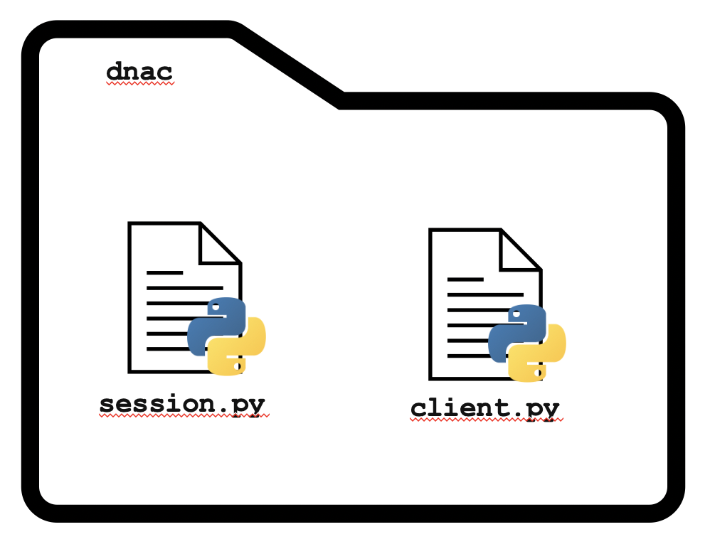
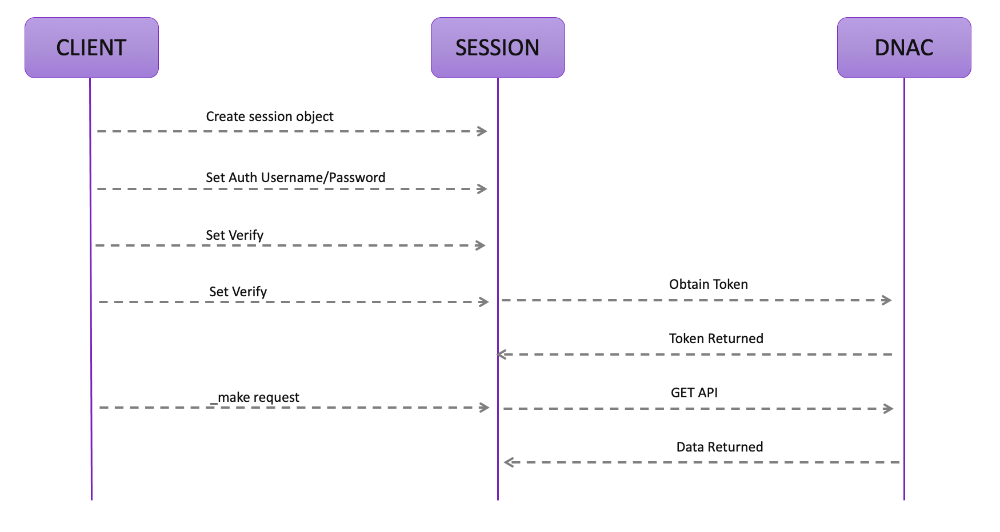

# Learn to Build a Basic Python SDK

Practice is critical in acquiring any new skill and automation is no exception.  This repository will walk you through the creation of a simple, non-production Python SDK.  The goal is not to create a production quality Python SDK since these already exist for many of the Cisco products, but rather to provide some guided practice using many of the requisite skills of an automation engineer today. 

Some of the skills you will practice in this walk-through are:

- Docker and Development Environments
- Version Control
- Basic Linux Commands 
- Python Fundamentals
- Common Data Formats (specifically JSON)
- REST APIs
- Development Design Patterns and Methodology

Through the remainder of this guide you will be walked, step-by-step, through the process of building your own SDK.  

## Prerequisite Skills

This walk-through assumes knowledge of:

- `git`
- Docker
- Python Fundamentals
- REST APIs

## What are you going to build?

Through this guided walk-through you will build a "relatively" simple Python Software Development Kit (SDK) to interface with Cisco's DNA Center.  Fundamentally, this SDK will have the following high-level  architecture:

The two Python modules together will enable the communication with DNA Center.  `session.py` will be responsible for maintaining the attributes related to establishing an HTTP session with the target host and `client.py` will act as the interface for the consumer of your SDK. 

## Next Up

The objective of this walk-through is simply to provide some guided practice of some of they key skills in the development and automation lifecycle.  Feel free to deviate off course to experience and practice outside of the confines of this walk-through.

Next, you will have the opportunity to practice some basic version control, Docker, and basic Linux skills getting the the project environment setup. 