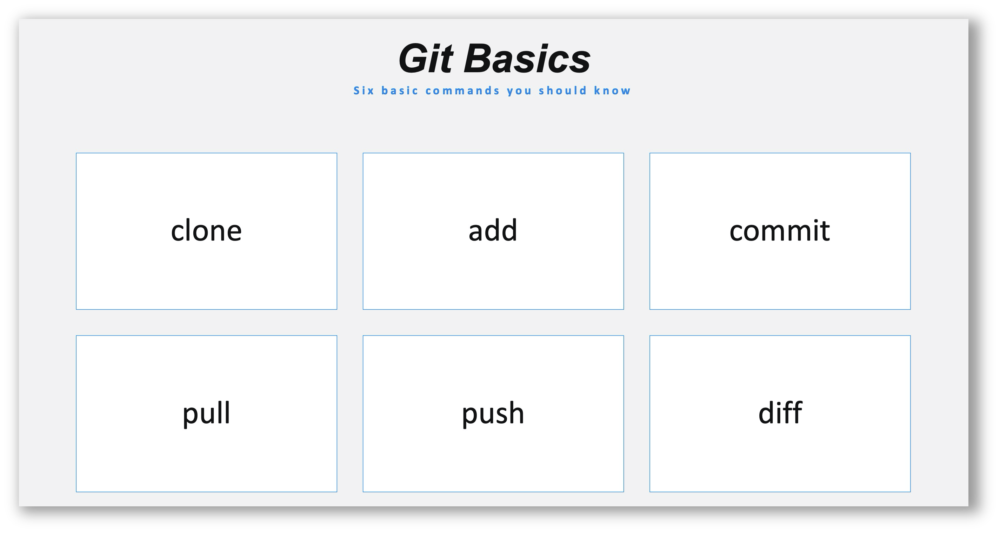
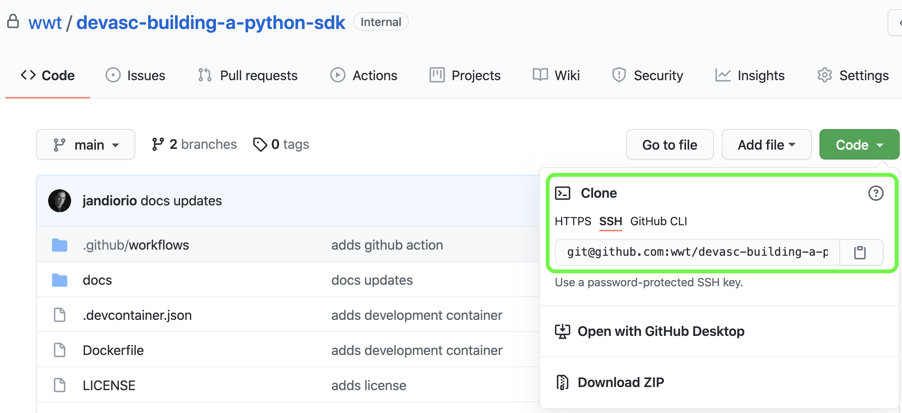

# Getting Setup

As with any development project there are some initial setup steps that are required to get things rolling.  In the case of this walk-through, the repository already exists as a starting point.  This section walks you through the process of cloning that repository down to your local machine, activating the development environment, and opening the project in your Integrated Development Environment.	

## Clone the Repo

One of the very first skills you learn when starting the journey to becoming an automation engineer is version control. This is a key skill in the development/automation lifecycle.  There are many, many command line options and details to understand about `git` but in typical daily workflows you will find yourself using a subset of them. Below are the six most common `git` commands used in a typical development workflow.

Many IDE's provide version control integration that allows you to utilize the UI in order to perform these functions.  You can chose what method works best for your personal workflow.  The steps below show how to clone a repo from a terminal window.

## STEPS

**STEP 1.** *NAVIGATE* to the repo on GitHub :arrow_right: [building-a-python-sdk](https://github.com/wwt/building-a-python-sdk){target=_blank} (Login to GitHub if required)

**STEP 2.** *CLICK* the **Code** button 

**STEP 3.** *SELECT* the transport (HTTPS or SSH)

**STEP 4.** *CLICK* the **Copy** icon

**STEP 5.** *OPEN* a new **Terminal**

**STEP 6.** *PASTE* `git clone` plus that string into your **Terminal**

!!! example
    **SSH** `git clone git@github.com:wwt/building-a-python-sdk.git`
    

    **HTTPS** `git clone https://github.com/wwt/building-a-python-sdk.git`

!!! important
    The command above will clone down the repository creating a subfolder with the name of the repo in the folder where you ran the command.

## Development Environment

All code in this walk-through was developed in a Docker container that was created from the `Dockerfile` included in the repository.  Including the `Dockerfile` in the repository means we can avoid the "...it works on my machine problem..." by using containers and also makes the container definition travel adjacent to the code. 

Below will cover using the Docker container for your execution environment.  Just click the tab that meets your needs:

**STEP 1.***OPEN* the new Folder in your Integrated Development Environment

=== "Visual Studio Code"

    If you are running **Visual Studio Code** as your IDE, and have the **Remove Development Extension** pack installed (`ms-vscode-remote.vscode-remote-extensionpack`) you can simply open the root directory of this project, then select **Reopen in Container** when prompted (dialog box in the lower right corner).
    
    The repository contains a portable development environment in the form of a `Dockerfile`, `requirements.txt`, and `.devcontainer.json` files.  
    
    This special integration with Visual Studio Code simplifies developing in a containerized development environment

=== "non-Visual Studio Code"

    If you are not using Visual Studio Code you can still utilize the :whale: Dockerfile packaged with the repository but some manual **build** and **launch** steps will be necessary.
    
    1. Ensure you are in the root of the `building-a-python-sdk` project
    2. *BUILD* the **Docker Image**
      `docker image build -t building-a-python-sdk .`
    3. *RUN* the **Docker Container**
      `docker container run -itv $PWD:/building-a-python-sdk building-a-python-sdk`

This repo contains a starting framework from which you will expand to build a Python SDK. 

## Section Wrap up

In this section, you used your knowledge of version control to clone down a shared repository, initialize the Docker container, and open the project in your preferred editor.  These are some of the most fundamental steps in getting started on your shared project.  

Next, you'll start the SDK project by creating a Python package.  It's OK if you are not experienced with creating a Python package; the following sections will walk you through that process.
