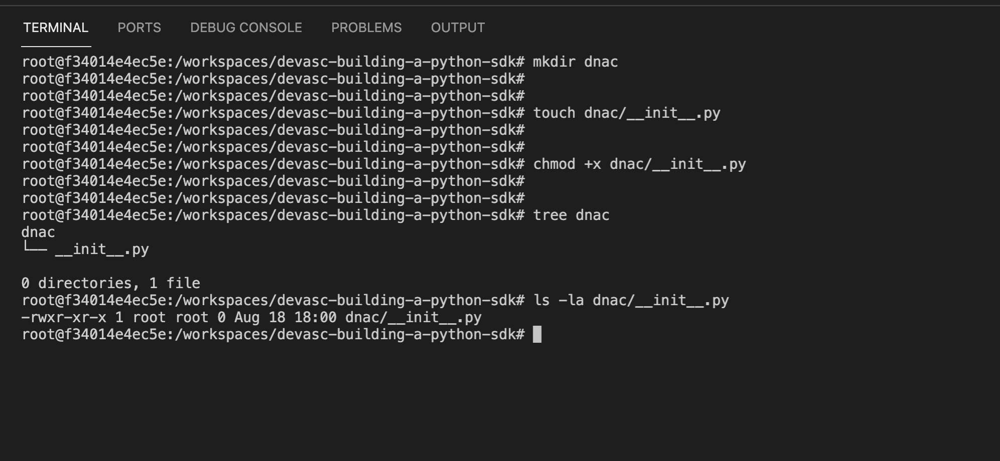
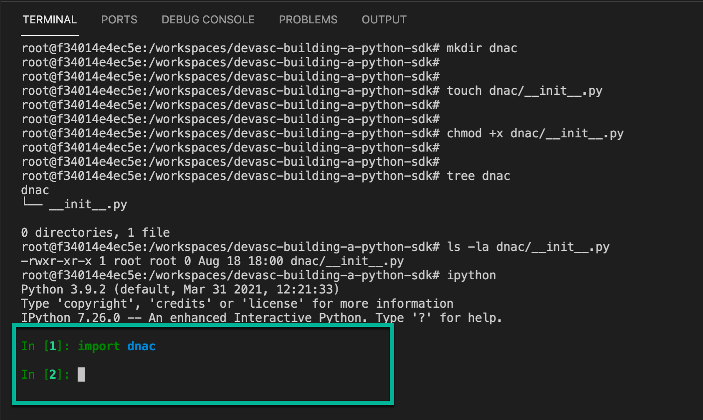

# Create a Python Package

In this section you will create a Python package that will become your DNA Center SDK. 

*Packages are namespaces which contain multiple packages and modules themselves. They are simply directories, but with a twist.*

*Each package in Python is a directory which **MUST** contain a special file called `__init__.py`. This file can be empty, and it indicates that the directory it contains is a Python package, so it can be imported the same way a module can be imported.*

*ref: https://www.learnpython.org/en/Modules_and_Packages*

## Steps

**STEP 1.** *CREATE* a folder named **dnac**

`mkdir dnac`

**STEP 2.** *CREATE* a file named **__init__.py** in the **dnac** folder

`touch dnac/__init__.py`

**STEP 3.** *MODIFY* the file permissions to add **execute**

`chmod +x dnac/__init__.py`

!!! question "Can you import this package?"
    If you completed these steps you can now import your package in the python interpreter.

That's exciting! :tada: You just created your first Python package.  Although it doesn't have any functional purpose yet, you learned some of the foundational mechanics required to start the process.
