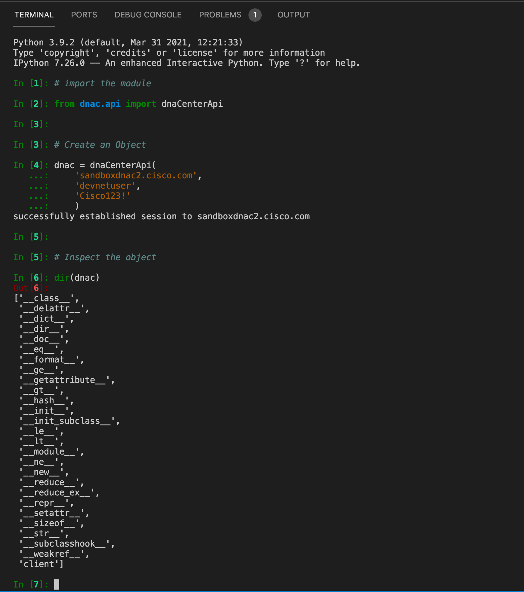

# Create a Python Module : API

The job of the API module is to *wrap* the REST endpoints available on the platform.  This section will build the API wrapper module using a combination of resources as a reference.

[DNA Center API Documentation](https://developer.cisco.com/docs/dna-center/#!cisco-dna-1-3-3-x-api-api-authentication-authentication-api)

[Python Classes](https://docs.python.org/3/tutorial/classes.html)

## Create the Class

1. *CREATE* a file named **api.py** in the **dnac/** directory (the package)

2. *OPEN* the `dnac/api.py` file in your editor

3. `import` the REST Client you created using relative imports 

   ```python
   from .client import dnacClient
   ```

4. *CREATE* a **class** named **dnaCenterApi**

   ```python
   class dnaCenterApi:
       
   ```

5. *DEFINE* a method named **__init__**

   ```python
       def __init__(self, host, username, password, verify=False):
           self.client = dnacClient(host, username=username, password=password)
   ```

!!! success "You did it!"
    Launch iPython and see if your code works.
    


## Add a Method

```python
    def get_sites(self):
        resource = "/dna/intent/api/v1/site"
        _url = f"https://{self.client.host}{resource}"
        self.client.session.headers = {'x-auth-token': self.client.token}
        r = self.client._make_request('POST', _url)
        if r.ok:
            return r.json()
```


## Add another Method

```python
    def get_network_devices(self):
        """ get network devices """

        resource = "/dna/intent/api/v1/network-device"
        _url = f"https://{self.client.host}{resource}"
        self.client.session.headers = {'x-auth-token': self.client.token}
        r = self.client._make_request('GET', _url)

        if r.ok:
            return r.json()
```

## Full File

```python
from .client import dnacClient

class dnaCenterApi:
    def __init__(self, host, username, password, verify=False):
        self.client = dnacClient(host, username=username, password=password)

    def get_sites(self):
        resource = "/dna/intent/api/v1/site"
        _url = f"https://{self.client.host}{resource}"
        self.client.session.headers = {'x-auth-token': self.client.token}
        r = self.client._make_request('POST', _url)
        if r.ok:
            return r.json()

    def get_network_devices(self):
        """ get network devices """

        resource = "/dna/intent/api/v1/network-device"
        _url = f"https://{self.client.host}{resource}"
        self.client.session.headers = {'x-auth-token': self.client.token}
        r = self.client._make_request('GET', _url)

        if r.ok:
            return r.json()

```


