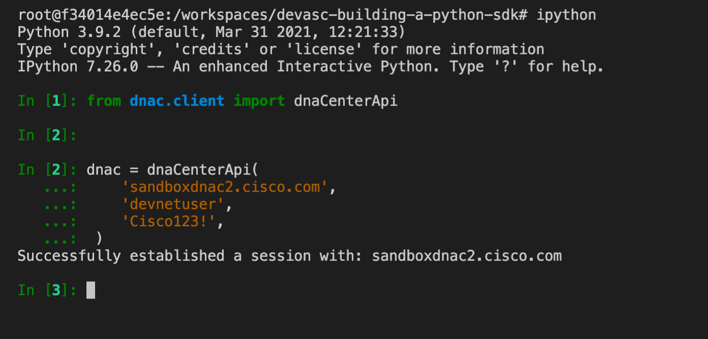

# Create a Python Module: client


The job of the **client** module is to *wrap* the REST endpoints available on the platform.  This section will build the API wrapper module using a combination of resources as a reference.

[DNA Center API Documentation](https://developer.cisco.com/docs/dna-center/#!cisco-dna-1-3-3-x-api-api-authentication-authentication-api)

[Python Classes](https://docs.python.org/3/tutorial/classes.html)

The client is the Python object that is the external interface for the SDK.  A consumer of this SDK would instantiate an instance of the client where all of the necessary methods would exist for interacting with the target system, DNA Center.

## Create the Module

**STEP 1.** *CREATE* a file named **client.py** in the `dnac/` directory (the package)

```shell
touch dnac/client.py
```

Python modules are just files with the `.py` extension.

**STEP 2.** *OPEN* the `dnac/client.py` file in your editor

**STEP 3.** `import` the REST Client you created using relative imports

This is the **session** module that you created in the last section and it will be referenced here.  

```python
from .session import dnaCenterSession
```

!!! tip "Read More on Relative Imports"
    Here is a reference for [Relative Imports](https://realpython.com/absolute-vs-relative-python-imports/) in Python

**STEP 4.** *CREATE* a **class** named **dnaCenterApi**

Since this is the wrapper class it isn't inheriting from any other existing class (except Object which is implied).  This is the main interface to the consumer of our SDK.

```python

class dnaCenterApi:
    """
    DNA Center API Wrapper Class
    """


```

**STEP 5.** *DEFINE* a method named `__init__`

The `__init__` constructor determines how an object is instantiated from a class.  I this case the `__init__` method will create a new **dnaCenterSesssion** object, set the **auth** and **verify** values, then call **get_token** to obtain a reusable token for all future calls.  

```python
    def __init__(self,
                 host: str,
                 username: str,
                 password: str,
                 verify: bool = True
                ):
        """Initialize the dnaCenterApi class object.  dnaCenterAPI
        provides an interface to the REST API of Cisco DNA Center

        Args:
            host (str): IP Address or Fully Qualified Domain Name of the DNA
                Center Appliance
            username (str): username is used for initial Basic Auth
            password (str): password
            verify (bool, optional): Certificate verification flag.
                Defaults to True.
        """
        self.session = dnaCenterSession()
        self.host = host
        self.base_url = f"https://{host}"

        if username and password:
            self.session.set_basic_auth(username, password)

        self.session.set_verify(verify)

        self.get_token()

```

**STEP 6.** *DEFINE* a method named `get_token`


This is only method that will use **Basic Auth**.  All other methods will utilize the token that is added to the header in this method.

```python
    def get_token(self) -> str:
        """Obtain an authentication token for subsequent API calls

        Returns:
            str: Token string that will be set in the x-auth-token header
                of the self.session object
        """

        _response = self.session.post(
            self.get_url('/dna/system/api/v1/auth/token')
            )

        if _response.ok:

            print(f"Successfully established a session with: {self.host}")

            self.session.headers.update(
                {
                    'x-auth-token': _response.json().get('Token')
                }
            )

```

**STEP 7.** *DEFINE* a method named `build_url`

This is a simple example of abstracting code that would need to be repeated in every API endpoint wrapper into its own method.

```python
    def build_url(self, resource: str) -> str:
        """Generate the full URL based on the self.base_url plus the provided
        resource (API endpoint)

        Args:
            resource (str): API Endpoint suffix as found in the API documentation

        Returns:
            str: Full URL for API call
        """
        return self.base_url + resource

```

**STEP 8.** *DEFINE* a method named `_make_request`

The `_make_request_` method is responsible for executing the `requests.Session.request` method which is associated with the `self.session` attribute of our **client**.  

```python

    def _make_request(self, method: str, url: str, json: dict = None, params: dict = None):
        """Execute the request method of the Session object

        Args:
            method (str): HTTP Method passed to the session object
                [ GET, POST, PUT, PATCH, DELETE ]
            url (str): Full URL of the API endpoint
            json (dict, optional): Body if required. Defaults to None.
            params (dict, optional): [description]. Defaults to None.

        Returns:
            [type]: [description]
        """

        results = self.session.request(method, url, json=json, params=params)

        if results.ok:
            return results.json()

        results.raise_for_status()

```

**STEP 9.**  *SAVE* the **file**

!!! success "You did it!"
    Launch iPython and see if your code works.



## Add API Wrapper Method to Get Sites

Now that the basic mechanics of your API Client work and you can establish a session with a DNA Center it's time to **add** some functions to target specific REST Endpoints.  The first endpoint that will be added is the **site** endpoint.

The `get_sites` method of our `dnaCenterApi` **client** targets the /dna/intent/api/v1/site endpoint and takes a single parameter named **params**.  Since this is specifically wrapping a GET request, the **params** parameter allows you to pass a dictionary of key/value pairs that will serve as the query parameters for that call.  See the [DNA Center API](https://developer.cisco.com/docs/dna-center/#!cisco-dna-1-3-3-x-api-api-sites-get-site) for more details on fields available.

```python
    def get_sites(self, params: dict = None) -> dict:
        """Retrieve the sites from DNA Center

        Args:
            params (dict, optional): query parameters to filter the results.
            Defaults to None.

        Returns:
            dict: dictionary of the response from DNA Center
        """
        resource = "/dna/intent/api/v1/site"
        return self._make_request(
                                  'GET',
                                  self.build_url(resource),
                                  params=params
                                  )
```


## Add API Wrapper Method to Get Network Devices

```python
    def get_network_devices(self, params: dict = None) -> dict:
        """Retrieves network devices from DNA Center
        Args:
            params (dict, optional): query parameters to filter the results.
            Defaults to None.
        Returns:
            dict: Network Devices
        """
        resource = "/dna/intent/api/v1/network-device"
        return self._make_request(
                                  'GET',
                                  self.build_url(resource),
                                  params=params
                                  )

```

## Full File

This is what the full file will look like for comparison.  You can also copy this and paste it over the contents you have created to be sure.  

```python
#!/usr/bin/env python

from .session import dnaCenterSession


class dnaCenterApi:
    """
    DNA Center API Wrapper Class

    """

    def __init__(self,
                 host: str,
                 username: str,
                 password: str,
                 verify: bool = True
                ):
        """Initialize the dnaCenterApi class object.  dnaCenterAPI
        provides an interface to the REST API of Cisco DNA Center

        Args:
            host (str): IP Address or Fully Qualified Domain Name of the DNA
                Center Appliance
            username (str): username is used for initial Basic Auth
            password (str): password
            verify (bool, optional): Certificate verification flag.
                Defaults to True.
        """
        self.session = dnaCenterSession()
        self.host = host
        self.base_url = f"https://{host}"

        if username and password:
            self.session.set_basic_auth(username, password)

        self.session.set_verify(verify)

        self.get_token()

    def get_token(self) -> str:
        """Obtain an authentication token for subsequent API calls

        Returns:
            str: Token string that will be set in the x-auth-token header
                of the self.session object
        """

        _response = self.session.post(
            self.build_url('/dna/system/api/v1/auth/token')
            )

        if _response.ok:

            print(f"Successfully established a session with: {self.host}")

            self.session.headers.update(
                {
                    'x-auth-token': _response.json().get('Token')
                }
            )

    def build_url(self, resource: str) -> str:
        """Generate the full URL based on the self.base_url plus the provided
        resource (API endpoint)

        Args:
            resource (str): API Endpoint suffix as found in the API documentation

        Returns:
            str: Full URL for API call
        """
        return self.base_url + resource

    def _make_request(self, method: str, url: str, json: dict = None, params: dict = None):
        """Execute the request method of the Session object

        Args:
            method (str): HTTP Method passed to the session object
                [ GET, POST, PUT, PATCH, DELETE ]
            url (str): Full URL of the API endpoint
            json (dict, optional): Body if required. Defaults to None.
            params (dict, optional): [description]. Defaults to None.

        Returns:
            [type]: [description]
        """

        results = self.session.request(method, url, json=json, params=params)

        if results.ok:
            return results.json()

        results.raise_for_status()

    # API Endpoints

    def get_sites(self, params: dict = None) -> dict:
        """Retrieve the sites from DNA Center

        Args:
            params (dict, optional): query parameters to filter the results.
            Defaults to None.

        Returns:
            dict: dictionary of the response from DNA Center
        """
        resource = "/dna/intent/api/v1/site"
        return self._make_request(
                                  'GET',
                                  self.build_url(resource),
                                  params=params
                                  )

    def get_network_devices(self, params: dict = None) -> dict:
        """Retrieves network devices from DNA Center
        Args:
            params (dict, optional): query parameters to filter the results.
            Defaults to None.
        Returns:
            dict: Network Devices
        """
        resource = "/dna/intent/api/v1/network-device"
        return self._make_request(
                                  'GET',
                                  self.build_url(resource),
                                  params=params
                                  )

```

## Section Wrap up

You now have a functional Python package that includes a **session** object and a **client** object. This package allows you to establish a connection/session with Cisco DNA Center and retrieve the sites and/or network devices using API methods you wrote to wrap the API endpoints.

In the next section you will write a simple Python script that uses this package.  The point of write a package to reduce the amount of code you have to write on subsequent tasks with the same logic.


